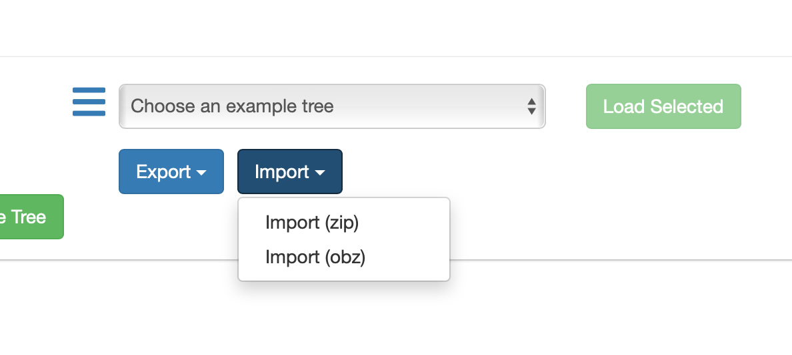

# Tree / Language file details

There are three formats that pasco reads langauge trees in.

1. **Mindnode - Markdown format.** 

Files look a little like this:

```
# Chat


## How are you?

- Ace!

- Whats that?

- 

## Whats happening?

- Yeah for sure

## I’m fed up


# I need something


## Its in my bag

## Its somewhere else

## Its upstairs


```

It's not the easiest to read - note that with markdown line breaks are key. It's easiest to generate this with something like MindNode - an iOS and Mac app to generate MindMaps. It really is a breeze 

2. **Tab OR Space Indented text file** 

Here a file looks like this:

```
Chat
	How are you?
	Ace!
	Whats that?
	Whats happening?
		Yeah for sure
	I’m fed up

I need something
	Its in my bag
	Its somewhere else
	Its upstairs

```

It looks a little easier to read - but be **warned** - spaces and tabs at the beginning cannot be mixed. Don't put a space and then a tab. Its not the easiest. 

3.  **Open Board format**

Pasco natively supports the [open board format](https://www.openboardformat.org).  To use this simply upload your board(s) as a 'obz' file in the **Configuration** screen - and hopefully it should work! Note that we of course strip images - and right now there is no built in 'cue' for items. We use the label for this.  

To export - select **Export** in the **Configuration** screen and select 'obz' format. 



