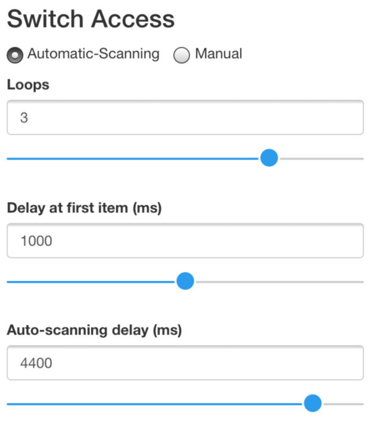
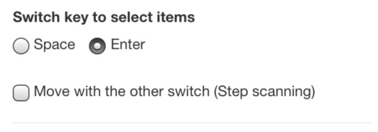

# Configuration Options

## Active Tree

Allows a user to switch the current active Tree. This means you could have one tree for social chat, another with spelling and another for a particular school or workplace. But more importantly it allows you to switch between a English only tree and a foreign language tree. More information, including how a user can switch without going into the configuration screen can be read [here](/advanced/tree-file-details.html). 

## On-Screen Navigation (Off by default)

Enable or disable the 4-way navigation tool. Remember - you can reposition this just by dragging it - and resize it by pressing and holding on the tool - then dragging one of the corners

## Helpers

We will add additional **'helpers'** (actions that alter the tree) here - but for now we only have one helper:

### Back option for all branches

This adds the option of 'Back' to the end of each Branch. It's really useful for single switch scanners to get back a branch if they need to. 

## Switch Access

Switch access works by mapping keyboard keys to different actions. A box which allows one or several switches to be plugged in and then connect to the device is then needed. Be aware that for pasco we are looking at switch boxes that support keyboard presses without any additional software. Some (such as the JoyCable and the Crick USB switch box) emulate a joystick button which won't work. Also switch boxes such as the Hook+ won't work either [unless you follow our guide on how to use iOS switch scanning with pasco](/tips-n-tricks/ios-switch-scanning.html). The following currently work with pasco on iOS:

* [Pretorian Applicator and iSwitch](https://www.pretorianuk.com/assistive-technology-for-ipad)
* [Origin Instruments Tapio](http://www.orin.com/access/tapio/)
* [Ablenet's Blue2 switch](https://www.ablenetinc.com/technology/computer-tablet-access/blue2-bluetooth-switch)
* [Tecla](https://gettecla.com). 

### Manual (Default)

By default switch access is set to **Manual** - which would allow someone to use the on-screen navigation tool - or use 4 switches to navigate the currently active language tree. For example the **arrow keys** - up, down, left & right - would allow someone to access the tree. Equally, the keys **a** (left), **s** (down), **d** (right), **w** (up) can be used. Lastly the keys **1** and **2** would allow a user to go **left** and **right** in the tree. 

#### Automatic-Scanning 

Automatic scanning, often called **"1 switch scanning"** allows a user with one switch to navigate pasco. The computer moves through each item so the user doesnt have to - and only selects the one they want when ready.

Be aware - you need to select which switch key selects (moves forward) - which you can do in the option "Switch key to select items".  There are then some options you can configure:

##### Loops (Default: 3)

The number of times the automatic scan runs through each level of the tree before stopping. 

##### Delay at first item (ms) (Default: 1000 ms)

It is sometimes useful to have a delay at the first item in each level of the branch to help someone to time their switch press. 

##### Auto-scanning delay (ms) (Default: 3000 ms)

The time the scanner moves from one item to a next automatically. Want it to scan quicker/faster? Move it down. Want it to scan slower? Move it up. 

#### First time run (Cue Voice)

For many people who are visually impaired its useful to 'hear' the items at each selected branch. This is like someone who is using their eyes to visually scan the interface. It give the user a fast way of scanning the items. If you turn this on we recommend making as fast as you can before the voice becomes hard to understand. ***Tip: This won't increase the speed of any recorded messages* **Note: This option is only available for automatic scanning**. 

#### Switch key to select items

Whether you are in Manual or Automatic scanning - and you are using a switch box that supports **Space** and **Enter** key emulation you need to choose which switch is going to be the **Select** key (i.e. the key that moves forward in the tree). 

#### Move with the other switch (Step scanning)
 
The most common usage though for anything other than automatic scanning is to setup **2 switch scanning** (aka **Step Scanning**). In this setup the user has one switch to **Move** and another to **Select**. For this use a switch box and set one switch to be **'Space'** and the other as **'Enter'**. In the configuration screen set which one you wish to be the **Select** and then select the checkbox which says **Move with the other switch (Step scanning)**. 

#### Minimum Cue Time (ms) (Default: 0 ms)

By turning this on it stops the user selecting a large number of items in the tree before hearing the cue. You can change the default time here. **Tip: You probably want to keep it under 500ms other wise it can feel laggy**/

#### Ignore second hits (ms) (Default: 100 ms)

This feature stops the switches being responded to if they are hit within this timeframe. So for example, if a user presses a switch and hits immediately afterwards - pasco will ignore this second press if it is within the timeframe. Some 

## Speech

### Cue Voice

### Main Voice 

## Appearance

### Font Size (%) (Default: 100%)

### Theme 

### Locale

## Tree

### Choose an example Tree
