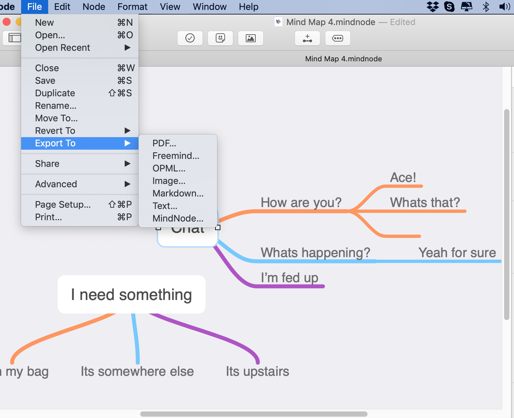

# Editing with MindNode

[Mindnode](https://mindnode.com) is a Mind Map editor. It works rather beautifully with pasco to develop complex deep language trees. Pasco supports its "Markdown" export file format. So for example a tree with two roots - may look like this:

and pasting the exported markdown file format into pasco we get:

